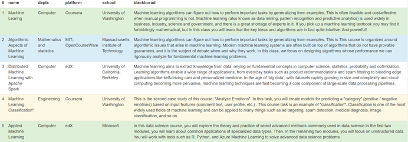
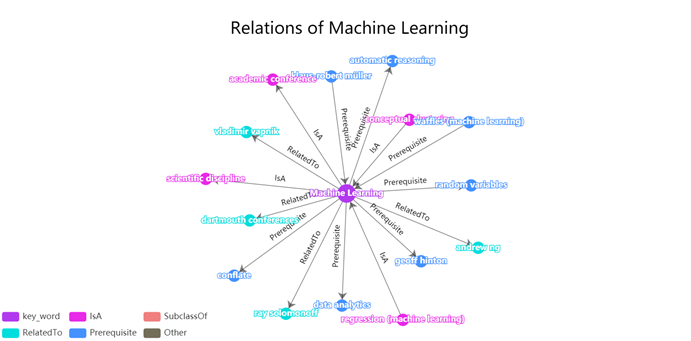
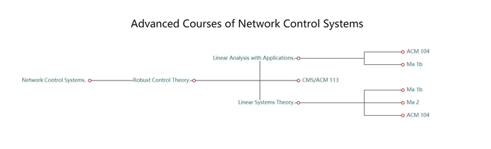

（不少于5000字）

摘  要：字数一般在300字左右。摘要必须反映全文中心内容，一般包括研究目的、方法、主要观点及结论。写作时，应简写目的，写明采用的具体方法，详细写所得到的结果和结论，要突出反映文章的创新性。要求语言简明、扼要、准确、客观、逻辑性强。总之，摘要应写得内容充实，不要过分抽象或空洞无物，避免使用“对……具有……意义，价值”等评价性用语，避免使用“本文”、“笔者”等第一人称写法。定稿时要注意纠正语病，删减啰唆重复的语句和句子。

关键词：词1；词1；词1（3-5个反应所研究的领域和关键特征的词）

下接正文（引言、导论性）或一级标题（引言、导论性）。论文要求主题明确、数据可靠、逻辑严密、文字精炼，遵守我国著作权法，注意保守国家机密。题名应恰当简明地反映文章的特定内容，要便于编制题录、索引和选定关键词，不宜使用非公知的缩略词、代号等。

0521：介绍方法而不要介绍技术细节（数据获取（哪些数据项 怎么集成 ） 数据存储 数据查询和展示）

介绍为什么用课程之间的先修关系去近似替代学习路径, 论证其合理之处. 

介绍词向量在概念相关度的应用.

找相似的学术报告, 比如学习路径规划, 知识图谱之类的. 

# 1 简介

可以谈知识量的爆发, 与立项申请书里边类似. 主要描述学生在面对海量知识来源时的困境. 突出学习路径规划的重要性, 和学术信息的准确性. 

我们的系统从数据资源中建立与计算机科学领域相关的概念, 关系, 可以为用户提供聚合和准确的信息. 并且从顶级高校的课程信息中抽取概念, 帮助用户分析整个领域的先修关系. 

我们认为可以带来方便. 

# 2 系统架构

​		图 1 展示了本系统的整体框架结构, 分为用户接口, 服务前端, 服务后端. 

​		在系统的服务后端, 有一个数据量巨大的概念图谱, 这个图谱数据库是我们系统基础的关键. 此图谱由xxx生成, 包含了概念和概念之间的联系. 后端数据基础的另一部分是一个文档索引, 这是词条解释, 学习路径规划功能的关键, 我们对词条解释的一部分进行索引, 以文档的形式放入分布式索引型数据库, 该数据库还包括我们收集的课程先修关系和课程信息等数据. (这些数据的处理过程可以放在其他部分讨论)

​		在系统的服务前端, 我们对用户的搜索文本进行处理, 以适应后端数据集的特点, 并按照设计的不同视图调用后端的多项服务. 例如, 搜索文本首先被发送到文档索引中, 得到词条解释与课程先修关系数据. 然后文本被发送到图数据库中, 以生成所需的概念图谱. 

​		在用户端, 用户只需键入需要搜索的文本并点击搜索, 即可生成一个检索请求. 而服务前端在收集到所需数据后, 会在网页上进行多个视图的渲染, 首先会将词条解释展示在搜索框的下方, 然后将概念图谱绘制在解释的下方, 在页面底部, 会生成学习路径规划图和推荐资源列表. 

索引技术与关系型数据库的区别, 好处. 

# 3 用户接口

分功能点描述.

3.用户接口

项目的载体是一个网站，页面如图2所示。其中用户与项目后端交互的主要方式也是在网页上搜索知识点和浏览返回的信息。我们将在下面详细介绍网站页面。

 

网页应用:

 

​       概念解释:

​    图2中展示了知识点的解释。解释来源于后端百科数据库，在用户输入知识点之后，利用全字匹配和字段搜索匹配数据库中最合适的节点，返回并展示其概念的解释。

 

课程信息展示：

如图 3 所示，课程页面显示与搜索的概念相关度较高的课程，数据同样来源于后端的数据库。课程信息展示分5项，分别是课程名称、所属类别、课程平台、来源学校、课程简介。

​      

学习路径展示：

​    在网页应用中，学习路径的展示即是知识图谱可视化的关键。我们将原本复杂的文本信息转化为结构化表示的知识，力求用更恰当的方式展示知识点间和相关课程间的关系。

**知识点关联**

在数据库中，一条条关系的定义用三元组存储。如图4所示，我们利用力导向关系图展示知识点间的关系。紫色节点代表用户搜索的中心知识点；粉红色代表互相包含的知识点；茶红色表示该知识点的子类；绿色代表相关的知识点；蓝色则代表知识点的先修知识；其他类别的知识点统一使用灰色表示。灰色箭头指代关系中的方向，单击每条边可以获得关于这对信息更多的内容。

**课程先修关系**

课程先修关系是项目组成员用爬虫在一些CS专业排名靠前的大学的公开信息网站收集整理的，存入一个结构化数据库。如图5所示，树图是一种比较适合展示课程先修关系的图形。最左边是用户搜索内容最贴近的课程，剩余的中从左至右依次是该课程的先修课程。单击节点可以选择展示或收缩节点。树图显示了学习这些课程的顺序，给了想要从头学习一门课的用户很大的便利和启发。

# 4 概念图谱

介绍如何构造概念图谱. 

首先说了生成概念, 这一部分说的很笼统.

然后是生成关系, 首先介绍了三种关系, 说明了系统中的关系的数量. 然后分类介绍, 我不知道这一部分是不是师姐的工作以及我们能不能写在这里.

然后是概念连接, 慕课中的概念和图谱中概念的连接, 这一部分应该是师姐他们做的, 我们没法写. 

这一部分占到师姐篇幅的一半. 

# 5 结语和展望

# 参考文献

[1]游忆.我国大学生学习策略的现状、影响因素与提升路径[J].湖北经济学院学报(人文社会科学版),2020,17(05):122-124.

[1]杨卉.基于个性化学习路径的大学计算机基础课程体系构建[J].科技风,2020(14):40.

[1]史志才,施一萍,张辉.论“数据结构”与“C程序设计”课程间的关系[J].高教学刊,2017(01):60-61.

[1]陈怀琛. 课程矩阵——论证教学计划的有效工具[C]. 中国电子教育学会高教分会.中国电子教育学会高教分会2009年论文集.中国电子教育学会高教分会:中国电子教育学会,2009:22-25.

