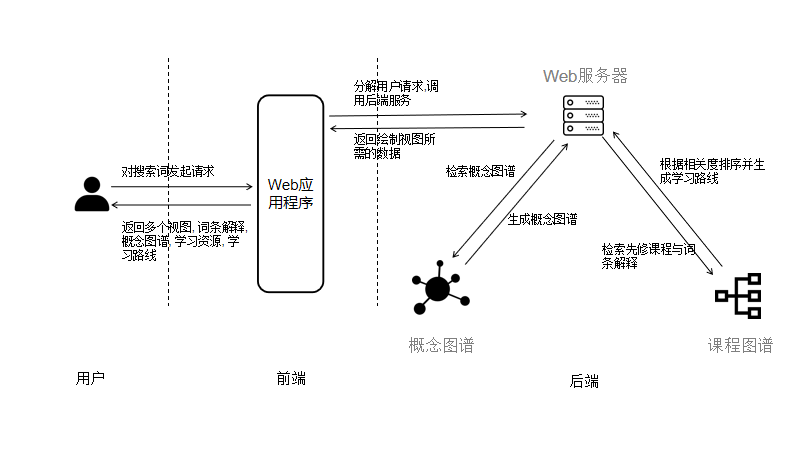

（不少于5000字）

摘  要：网络学习资源内容庞杂且碎片化,时常使大学生在利用网络学习未知领域时无从下手。如果能够快速获取该领域合适的学习顺序，并搭配相关学习资料，将极大地提升大学生的学习效率与系统性。因此我们开发了一个面向大学生的个人知识助理系统，可以一站式地为用户提供学习指导。系统包括两个部分：（1）一个大规模的信息科学领域的知识图谱，包含信息科学领域内的各种概念及其关系，（2）一个web应用，允许用户搜索信息科学领域的概念，查询概念的解释及相关概念，获取该概念的学习路径，并查看学习该概念可利用的若干资源。个人知识助理系统能为大学生提供聚合且准确的信息，帮助大学生理解领域知识体系、合理规划学习路径，从而更加有效地利用网络资源开展未知领域的学习。
关键词：知识图谱；学习路径规划； 先修关系

# 1 简介

#### 更新版引言

大学是学习的的重要阶段，信息时代的大学生不但需要在课堂上学习知识，也需要充分利用互联网上的资源，通过自主学习不断提升自己。然而，网络学习资源内容庞杂，学什么、怎么学、从哪学起，这是学习者普遍面临的问题。我们的调查显示，89.55%的学习者在学习未知领域感到或多或少的迷茫，缺乏方向。在这样的背景下，如果能够利用计算机技术合理地对学习内容进行排序，推荐一条学习路径，并提供相关的学习资源，将有效地减少学习者搜集学习资源、确定学习顺序的时间，从而极大的提高初学者在进入未知领域时的学习效率和学习系统性[a][b]。

知识图谱是以科学知识为对象，显示学科的发展进程与结构关系的一种图形，具有“图”和“谱”的双重性质与特征。【1】知识图谱本质上是一种大型的语义网络，旨在描述客观世界的概念实体及其关系。目前典型的知识图谱有基于维基百科创建的DBpedia、大众协作编辑创建的Wikidata、Freebase等，主要应用的领域有语义搜索、智能问答、个性化推荐、大数据分析。知识图谱可以较好地表示概念、课程、学习资源及它们之间的关系，是构建个人知识助理系统的极佳载体。

本项目开发了一个面向大学生的个人知识助理系统，基于知识图谱提供一站式的学习指导，辅助大学生进行信息科学领域的学习路线规划，并提供知识点全面解析和相关资源推荐。项目基于维基百科等开源数据及美国大学的课程数据，构建了信息科学领域的知识图谱；并通过获取维基链指和课程先修信息来构建概念之间的不同类型的关系。接着，项目基于词嵌入的相似度计算得出较有可能的具备先修关系的概念对和课程对，从而从概念图谱中抽取学习路径。最后，通过整合书籍、MOOC、大学课程等资源，对于每个概念，得出学习该概念的若干推荐资源。该系统选题新颖，形式创新，利用高度可视化的图结构展示先修关系及学习路径，可以给予学习者更流畅、高效的学习体验。
本文的第二部分将介绍项目的整体架构，第三部分将介绍Web应用及其功能，第四部分将介绍知识图谱的结构，第五部分为结语和展望。

#### 国内外知识图谱应用现状与未来趋势分析（你们看看放在哪里合适）：

知识图谱是以科学知识为对象，显示学科的发展进程与结构关系的一种图形，具有“图”和“谱”的双重性质与特征。【1】知识图谱本质上是一种大型的语义网络，旨在描述客观世界的概念实体事件以及及其之间的关系。

知识图谱这个概念最早由Google提出，主要是用来优化现有的搜索引擎。不同于基于关键词搜索的传统搜索引擎，知识图谱可用来更好地查询复杂的关联信息，从语义层面理解用户意图，改进搜索质量。自谷歌公司于2012年推出第一版知识图谱以来，掀起了知识图谱高速发展的序幕，Wordnet、ConcepNet、Freebase 等相
 继被开发与应用，其中普林斯顿大学开发的 Wordnet 是目前最典型的词典类知识库；ConceptNet 则拥有大量开放的结构化数据，通过专家外包等方式，不断地扩展知识图谱的内容。【2】在国内，各大互联网企业也纷纷推出自己的知识图谱产品来提升搜索质量，如百度的“知心”与搜狗的“知立方”等…

知识图谱主要应用领域有语义搜索、智能问答、个性化推荐、辅助决策和反欺诈等。然而在技术上还存在种种挑战，比如数据降噪、非结构化数据处理能力和知识推理。这些挑战需要熟练应用机器学习、数据挖掘和自然语言处理等技术才能够解决，这也导致知识图谱在工业界还没有形成大规模的应用。

不过可以预见的是，知识图谱在学术研究的应用越来越广，在人工智能领域的地位不断升高，未来几年内必将成为工业界的热门工具。

##### 参考文献

[1]杨思洛, 韩瑞珍. 国外知识图谱的应用研究现状分析[J]. 情报资料工作, 2013(06):16-21.

[2]刘世豪.我国知识图谱运用的研究现状与未来趋势——基于共词分析的可视化研究[J].中小学电教,2019(10):24-27.

可以谈知识量的爆发, 与立项申请书里边类似. 主要描述学生在面对海量知识来源时的困境. 突出学习路径规划的重要性, 和学术信息的准确性.~~

~~我们的系统从数据资源中建立与计算机科学领域相关的概念, 关系, 可以为用户提供聚合和准确的信息. 并且从顶级高校的课程信息中抽取概念, 帮助用户分析整个领域的先修关系.~~

~~我们认为可以带来方便.~~

#### 旧的引言

大学是学习的的重要阶段，信息时代的大学生不但需要在课堂上学习知识，也需要充分利用互联网上的资源，通过自主学习不断提升自己。随着互联网技术和e-learning、移动学习的兴起，越来越多的人通过互联网资源进行自学。然而，网络学习资源内容庞杂，学什么、怎么学、从哪学起，这是学习者普遍面临的问题。

我们的调查显示，89.55%的学习者在学习未知领域感到或多或少的迷茫，缺乏方向。一方面，在搜索引擎中搜索相关领域的知识时，会返回海量的结果文档，其中不乏广告等低质量内容，需要主动筛选。另一方面，学习者往往需要在多个平台进行搜索，阅读众多不同的信息，才能最终得出结论、规划学习路线，而这需要充足的时间和较强的检索能力。因此，面对互联网上海量的、碎片化的学习内容，学习者在开始学习未知领域的时候较难系统化、高效率地对这个领域的内容划分学习目标，从而展开自己的学习。

在这样的背景上，如果能够利用计算机技术合理地对学习内容进行排序，推荐一条学习路径，并提供相关的学习资源，将有效地减少学习者搜集学习资源、确定学习顺序的时间，从而极大的提高初学者在进入未知领域时的学习效率和学习系统性。

本项目开发了一个面向大学生的个人知识助理系统，基于知识图谱辅助大学生进行信息科学领域的学习路线规划，并提供知识点全面解析和相关资源推荐。项目基于维基百科等开源数据及美国大学的课程数据，构建了信息科学领域的概念图谱；并通过获取维基链指和课程先修信息来构建概念之间的不同类型的关系。接着，项目通过抽取概念介绍中的关键词，并利用相似度计算，得出较有可能的具备先修关系的概念对，从而从概念图谱中抽取学习路径。最后，通过整合书籍、MOOC、大学课程等资源，对于每个概念，得出学习该概念的若干推荐资源。我们觉得这个系统可以从多个方面为学生提供帮助。

最终实现的系统包括两个部分：（1）一个大规模的信息科学领域的知识图谱，包含信息科学领域内的各种概念及其关系，（2）一个web应用，允许用户搜索概念，查询概念的解释及相关概念，获取该概念的学习路径，并查看学习该概念课利用的若干资源。此个人知识助理系统可以为学习者提供聚合和准确的信息，帮助学习者分析整个领域的先修关系，从而更加有效地利用网络资源开展未知领域的学习。

本文的第二部分将介绍项目的整体架构，第三部分将介绍Web应用及其功能，第四部分将介绍知识图谱的结构，第五部分为总结与讨论。

# 2 系统架构

​		个人知识助理系统是一个调用多种后端服务的Web应用。图1展示了本系统的整体框架结构，分为用户端，服务前端，服务后端。 

​		在用户端，用户只需键入需要搜索的概念并点击搜索，即可生成一个检索请求。服务前端在收集到所需数据后，会在网页上进行多个视图的渲染，首先会将词条解释展示在搜索框的下方，然后将概念图谱和学习路径绘制在解释的下方，在页面底部，会生成学习路径规划图和推荐资源列表。
在系统的服务前端，我们对用户的搜索文本进行处理，以适应后端数据集的特点，并按照设计的不同视图调用后端的多项服务：搜索文本首先被发送到全文索引中，得到词条解释与课程先修关系数据；然后文本被发送到图数据库中，以获取生成概念图谱与概念学习路径所需的信息。
在系统的服务后端，知识图谱被分为两个部分，一部分是一个数据量较大的概念图谱，这个图谱数据库是我们系统基础的关键。 此图谱的数据来源包括Wikipedia[6]，Wikidata[4]，MultiWiBi[7]，WordNet[8]，图谱其中包含了概念和概念之间的关系。另一部分是一个课程图谱数据库，其中包括我们收集的课程先修关系和课程信息等数据，以及大量概念解释。这个数据库是词条解释、学习路线规划功能的关键，对于这一部分数据，我们对其进行了全文索引。
 对于词条解释功能和学习路线规划功能所用到的数据，最初是以三元组和传统数据库索引的形式存放。但是小组成员在测试中发现，对于全文检索来说，关系型数据库存在不少缺点，例如响应速度较慢，无法自动计算相关度，无法进行泛化的搜索等，而采用倒排索引技术可以有效解决这个问题。相关研究证明了这个观点[3]。因此我们将这一部分数据导入到全文搜索引擎中，实现了全文搜索和相关度计算的功能。

# 3 用户接口

个人知识助理系统作为一个Web应用有着良好的用户接口设计，其中用户与应用交互的主要方式为：用户在网页上搜索知识点、浏览返回的信息，包括概念的解释，生成的知识图谱、项目规划的学习路径以及推荐的学习资源等。我们将在下面详细介绍应用界面这一部分内容。

**概念解释**

概念的解释源于后端数据库，在用户输入知识点之后，利用全字匹配和字段搜索匹配数据库中最合适的节点，返回并展示其概念的解释。

 

**生成知识图谱**

在数据库中，一条条关系的定义用三元组存储。如图3所示，知识图谱可视化时，我们利用力导向关系图展示知识点间的关系。紫色节点代表用户搜索的中心知识点；粉红色代表互相包含的知识点；茶红色表示该知识点的子类；绿色代表相关的知识点；蓝色则代表知识点的先修知识；其他类别的知识点统一使用灰色表示。灰色箭头指代关系中的方向，单击每条边可以获得关于这对信息更多的内容。图谱的生成和概念间关系的计算方法见第四部分的内容。

**规划学习路径**

任何知识点都不是孤立的，对一个知识点的理解建立在理解一些“基础知识点”上，这些“基础知识点”就是学习该知识点的“先修知识点”。学习路径是学习活动的有序序列[11]，一条学习路径上顺序在前面的学习活动是顺序靠后的学习活动的基础。
在网页应用中，学习路径的展示是知识图谱可视化的关键。我们将原本复杂的文本信息转化为结构化表示的知识，用更恰当的方式展示相关课程间的关系。课程先修关系是项目组成员爬取了美国若干大学的计算机课程，并存入结构化数据库。我们利用树图展示课程的学习路径，如图4。最左边是用户搜索内容最相关的课程，之后从左至右依次是该课程的先修课程、先修课程的先修课程。单击节点可以选择展示或收缩节点。树图显示了学习这些课程的顺序，给了想要从头学习一门课的用户很大的便利和启发。课程学习路径的生成方法见第四部分。

**推荐学习资源**

如图 5所示，课程页面显示与搜索的概念相关度较高的课程，数据同样来源于后端的数据库。课程信息展示分5项，分别是课程名称、所属类别、课程平台、来源学校、课程简介。

​      

# 4 概念图谱

	介绍如何构造概念图谱. 
	
	如何提取概念：从多种开源数据库中对文本进行识别，提取。
	
	如何生成关系, 首先介绍了三种关系, 说明了系统中的关系的数量. 
	然后分类介绍, 我不知道这一部分是不是师姐的工作以及我们能不能写在这里。
	
	（然后是概念连接, 慕课中的概念和图谱中概念的连接, 这一部分应该是师姐他们做的, 我们没法写. 这一部分占到师姐篇幅的一半. ）

	说明爬取的课程数据具体源自哪些大学，年份范围，如何整理为三元组。

(总) 
整个系统的基础是一个大规模的信息科学领域的知识图谱，分为两个部分，第一部分是一个基于维基百科等开源数据构建的概念图谱，存储在图数据库中；第二部分是美国大学的课程图谱，以三元组表形式存储在关系型数据库中。下面将依次介绍这两部分的数据获取、存储与构造。

1.概念图谱
（1）概念图谱的构造
我们的概念图谱基于维基百科的数据构建。维基百科是一个多语言、协作编辑的百科全书，每一个维基条目包含一个词条的基本信息、词条解释、相关词条等。我们将每一个维基条目抽取为一个概念，并将概念之间的关系划分为先修关系、属于关系、相关关系三类。
先修关系的建立。先修关系的建立对于本系统最为重要。由于并没有哪个开放数据集提供直接的概念先修关系，我们首先选择了若干可以描述先修关系的特征，接着对每两个概念，计算特征值之后输入预训练好的逻辑回归模型，判断是否具备先修关系。选取的特征包括从概念1指向概念2的维基链指数目、从概念2指向概念1的维基链指数目、两概念间共享的链指的数目、两概念间的引用距离[13]、两概念间的正则Google距离[14]以及两概念同时出现在MOOC课程中的次数。
属于关系的建立。由于维基条目之间的链指本身并不能指明属于关系，我们使用MultiWiBi数据集的属于关系，并集成了WordNet中的上下位关系、Wikidata中的实例关系和子类关系，共同作为本概念图谱中的属于关系。
相关关系的建立。判断两个概念是否相关，既要考虑两者的语义相关性，即概念的名称本身是否相关；又要考虑两者的结构相关性，即考查两者在整个概念体系中是否处于相似的层级位置。我们分别计算概念的词嵌入表示和网络嵌入表示，取两者的算术平均作为该概念的最终向量表示。计算每两个概念的向量表示的余弦相似度，超过一定阈值则认为这两个概念间存在相关关系。

（2）概念图谱的查询 
对概念进行查询时，将在概念图谱上进行搜索，并生成学习路径。 概念的学习路径由具备先修关系的概念对扩展而成。为了生成概念的学习路径，我们首先基于词向量计算出每个概念的短语向量供搜索时使用，之后在概念图谱上进行搜索。对于用户查询的概念，我们以该概念的节点为源点，在概念图谱上进行两个方向的广度优先搜索，前向的广度优先搜索从源点开始向前搜索其先修概念，后向的广度优先搜索从源点开始向后搜索其后置概念，即源点是哪些概念的先修概念。不同于普通的广度优先搜索在所有儿子节点上进行扩展搜索，为了提高搜索的效率和精确度、避免学习路径中出现过多概念或相关度过低的概念，我们的算法首先基于词向量计算出每个概念的短语向量，随后在进行搜索时，利用余弦相似度计算节点和与其具备先修关系的所有儿子节点的相似度评分，筛选出评分最高的若干儿子节点继续向外扩展。这样就得到了节点数目有限且相关度均较高较为精准的概念学习路径。

2.课程图谱
（1）课程图谱的构造
我们用于计算课程学习路线的数据，来自计算机/信息领域全球顶级高校的相关课程信息。这些学校包括加州理工学院（California Institute of Technology），麻省理工学院（Massachusetts Institute of Technology），华盛顿大学（University of Washington）和斯坦福大学（Stanford University）。我们从网络公开信息中获取了这些学校从2012年到2019年的与信息科学有关的课程信息，并识别了其中发生过信息更新的课程，从而得到了较为准确的信息。我们利用半自动化的方法提取出课程介绍中包含的课程先修关系，使其与课程的其他信息区分开来，这个过程中使用了模式匹配，同时我们也对课程的其他信息进行了结构化处理并放入数据库。最终获得的课程数量为560门，先修关系对的数量为707条。
先修关系是用三元组表存放的，在数据库中，每一行表示一个课程，且都有一个字段存放其所有先修课程的代号，这样每一行就是一个三元组的集合。将所有的课程存放在一起形成整个数据库。

（2）课程图谱的查询
概念的学习路径可以展示出概念的学习顺序和概念之间的上下位关系，但是对于如何去学习、理解这些概念仍没有比较清晰的指导，所以系统在概念学习路径的基础上展示了相关课程的学习路径，告诉学习者可以利用哪些开放课程或书籍资源开展对特定概念的学习[10]。由于不同学习者具备的基础知识不同，学习者可以结合自己对知识的掌握水平，在课程学习路径上自主选择学习起点。
对于用户查询的概念，系统会推荐相关课程，在此基础上展示课程的学习路径。课程的学习路径由课程之间的先修关系构成，课程之间的先修关系以三元组表的形式存储在关系型数据库中。在三元组表的基础上，我们使用第一遍遍历生成全部课程的列表，并对应存储每门课程的先修课程。接着进行第二遍遍历，对每一门课程，递归地查找其先修课程的全部先修课程并存储，从而得出可以以树图形式展现在网站上的课程学习路径。

# 5 结语和展望

本项目开发的个人知识助理系统，基于知识图谱提供一站式的学习指导，辅助大学生进行信息科学领域的学习路线规划，并提供知识点全面解析和相关资源推荐。
项目在算法实现、展示形式和研究方向上开拓创新，集内容丰富度与研究深度集一体，较好地完成了数据获取及结构化、知识图谱的组建与展示、用户输入处理与前端设计这些研究内容。最终构建了一个大规模的信息科学领域的知识图谱，包含信息科学领域内的知识点概念及关系，和一个web应用，为用户提供概念搜索、概念解释及相关概念、学习概念的路径和与该概念有关的若干资源。能够有效帮助大学生利用网络资源在未知领域开展学习。
本项目的成果——个人知识助理系统，可以帮助用户获取专有名词的解释，并规划该领域的学习路径。对于进入新领域学习的用户来说，具备极高的参考价值。结合更多的数据，本项目可发挥更大的功效。通过加入过滤算法等，将国内外百科网站上与学术有关的内容收集下来，形成专门用于学术的Wiki；或与搜索引擎合作，优化知识点的搜索结果；与信息科学领域相关的学习网站合作，帮助用户规划学习路径。
更重要的是，项目已经搭建了资源推荐的框架，它也是一种整合全网资源的途径。我们相信这种创新的结构化数据获取方式和知识图谱的构建过程未来一定能够在众多应用场景中发挥作用。

# 参考文献

[1]	游忆.我国大学生学习策略的现状、影响因素与提升路径[J].湖北经济学院学报(人文社会科学版),2020,17(05):122-124.
[2]	杨卉.基于个性化学习路径的大学计算机基础课程体系构建[J].科技风,2020(14):40.
[3]	https://wiki.dbpedia.org
[4]	https://www.wikidata.org
[5]	https://developers.google.com/freebase/
[6]	https://www.wikipedia.org
[7]	http://wibitaxonomy.org
[8]	https://wordnet.princeton.edu
[9]	王振风. 基于Lucene的分布式全文检索技术的研究与应用[D].东华大学,2015.
[10]	杨淼,董永权,胡玥.基于学习者建模和数据挖掘的个性化学习路径推荐研究[J].上海教育评估研究,2019,8(05):58-61. 
[11]	彭邵东.基于SCROM标准的“学习路径”设计[J]. 计算机工程，2004(12):42-27.
[12]	杨思洛,韩瑞珍. 国外知识图谱的应用研究现状分析[J]. 情报资料工作, 2013(06):16-21.
[13]	C. Liang, Z. Wu, W. Huang, and C. L. Giles. Measuring prerequisite relations among concepts. In Proceedings of the 2015 Conference on Empirical Methods in Natural Language Processing, pages 1668–1674, Sept. 2015.
[14]	D. Milne and I. H. Witten. An effective, lowcost measure of semantic relatedness obtained from wikipedia links. In Proceedings of the first AAAI Workshop on Wikipedia and Artificial Intelligence, 2008.

