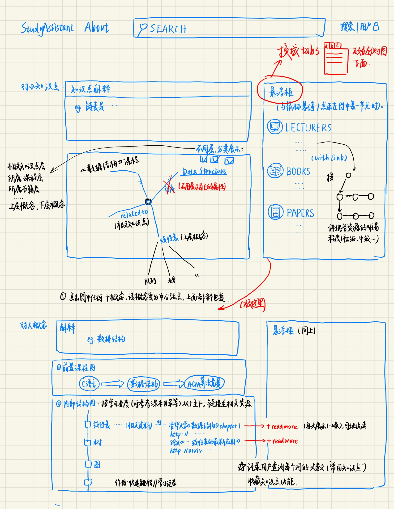

# 网站开发文档(与使用文档)

我们的应用程序以网站的形式构建, 主要界面的设计图如下:



## 需求列表

+ 搜索功能接收的输入是某个概念, 这个概念可以是一些比较具体的知识点, 也可以是一个比较宽泛的领域. 

结果包括很多方面.

+ 对这一概念的简短解释.(类似百科?) 
+ 概念的网状图, 联系与该概念有关的其他概念结点, 该图可以添加动态效果, 比如区分中心结点和周围结点, 各结点的点击效果, 据此对概念解释进行的更改...
+ 与该概念有关的资源列表, 比如论文和书籍(这一功能需要数据支持,暂时**不具备条件**)
+ 如果搜索的概念命中了某个课程, 或者与课程有很强的关系. 可以展示课程数据库中的课程介绍和课程的先修关系. 课程内部的学习方案生成需要数据支持, 暂时**没有解决方案**?
+ 课程先修关系可以使用树状结构展示.


## 设计与实现

### 概述

+ 数据内容范围限于计算机科学领域.

+ 使用python中的flask框架实现网站架构. 

+ 搜索功能使用ElasticSearch实现.

+ 数据库使用开源的MySQL支持.

+ 图数据库使用neo4j.

  

### 网站路由结构

该表格需要维护.

| 路由     | 主要功能                                                     |
| -------- | ------------------------------------------------------------ |
| /        | 欢迎界面,提供注册和登录的链接.                               |
| /signup  | 注册界面, 提供注册功能,将用户的注册信息添加到数据库. 注册成功后重定向到"/welcome"路由. |
| /signin  | 登录界面, 提供登录功能, 验证用户输入, 验证成功后重定向到"/welcome"路由. |
| /welcome | 登录后的界面, 进行内容的展示.(可以考虑与首页合并, 设计不同的视图.) 提供登出选项, 重定向到"/" |

未登录用户:
不能进入welcome界面(welcome路由)
不能登出(进入signout路由)
登录用户:
不能进入index路由(暂时)
不能登录.


20200211待完善:

1. 标签页的样式（感觉是和landingpage的样式有冲突）
2. 关闭网页时自动logout（否则再次打开无signin signup按钮，只有最下方有welcome按钮），需要修改
3. 注册/登录成功后消息flash在页面顶部，刷新才会消失
4. welcome页面的搜索框是否需要加`<form method="post">`？

20200226:
老师提供的数据库包括8个表：
可用：

1. concept: concept和definition，均为text， 3810000+条，但只有少数与计算机相关
2. entity: EntityName和Wiki(其维基百科链指)，153个实体，大概一半跟计算机有关，待探索用法
3. mooc: name, chinesename, duration, platform, school, department
    1988条数据，其中200为计算机领域课程，中英文都有，url全不可用

不可用：
1. user: 师姐项目的user
2. userentity: EntityName和Master，意义不明
3. entityvideo: VID, EName, time，不可用（师姐遗留）
4. uservideo: VID, lastlearn(日期时间)
5. video: VID, VName, Course, Vurl，是Coursera上部分视频的记录，只涉及5门课内47个视频片段，大概是师姐遗留产物


## 搜索功能

搜索功能的基础是事先用ES建好数据库的索引.
在webapp中, 主要工作是完成当用户请求查询时, 调用ES的搜索接口检索索引, 返回给用户, 或者, 根据索引中的内容到数据库中查询, 然后返回给用户.
初步实验仅使用concept表.

建立索引的过程是把数据库中的数据先用python读入, 再写到ES的结点上, 这一部分由樊完成. 疑问: 为什么不使用"如果条目存在就跳过插入"的命令.

搜索功能的实现放在welcome路由. 具体方式为搜索框提交的内容发送到该路由, 函数内根据获取的文本进行搜索, 然后进行渲染. 

## 20200310 实现查询知识点的功能

## 20200314 实现查询相关慕课的功能

## 20200313 粗略加了mooc查询部分  
待完善：
1. 查询的精细化：添加权重等
2. 普通数据库->ORM形式，这样才能比较优雅地“返回id，用id去数据库中查询，送至模板”。当前只是单纯返回全部数据。
3. 更好的数据展示方式，如何跳转，如何折叠+readmore展开


## 20200322 本周大家进展都比较慢
老师给的neo4j数据部分，参考师姐的论文：
1. IsA关系：用Wibi_IsA + Wordnet_Hypernyms + WikiData_SubclassOf + WikiData_InstanceOf
2. Prerequisite关系：来自Wikipedia links和MOOCs。通过计算特征、训练逻辑回归模型、计算得到任意两个概念之间是否有先修关系。模型是基于别人的wikipedia concept map dataset预训练的。
3. RelatedTo关系：利用skip-gram和node2vec模型分别学习word embedding和network embedding，平均数作为最终embedding. embedding的相似度大于0.3并且有直接link则作为RelatedTo关系

从师兄给的代码可以看出，prerequisite是neo4j中的KGBnu_Ref, RelatedTo是KGBnu_RelatedTo

## 20200323 实现neo4j的查询功能
neo4j 4.0版本需要java11，所以推荐下载[neo4j community edition 3.5.16版本](https://neo4j.com/download-center/#community)

#### 启动neo4j服务器：
在git bash中进入bin目录，执行`./neo4j.bat console`打开neo4j的控制台，可在http://localhost:7474/查看。 console命令之外，还有start:启动服务，stop：关闭，status：查看运行状态，install-service：安装neo4j在windows上的服务
- 区别：service只要不stop，会随系统启动而自动启动，无需操作。而console需要运行命令才能启动，关闭则stop

#### 导入师兄的数据：
首先neo4j stop关闭服务
接着neo4j-admin.bat load --from=E:/KGProject/2016-10-02.dump --database=graph.db --force导入
重新开启服务即可使用

## 20200325 实现echarts画图

第一组数据的起始节点是查询节点时画图有错，待debug


### 测试

20200223

测试时同一个测试函数（针对同一个页面）内不会清空数据库，在测试该页面上不同的功能时可能需要手动退出之前的用户登录或者清空数据库

对assert的了解不够深入，不知道是否有更高效和精准的方法

目前的测试只有76%的覆盖率，还需提高

执行单元测试的方法：（出错则可看到出错信息）

```
(env) $ python test.py
...............
----------------------------------------------------------------------
Ran 15 tests in 2.942s

OK
```

查看测试覆盖率：

```
(env) $ pip install coverage
(env) $ coverage run --source=flaskweb test.py  (测试并汇报)
$ coverage report
Name     Stmts   Miss  Cover
----------------------------
xx.py     146      5    97%
```

20200224:
使用包组织程序，调整后项目文件结构如下：

```
├── .flaskenv
├── test.py            # 测试程序
└── flaskweb           # 程序包
    ├── __init__.py    # 包构造文件，创建程序实例和拓展对象，定义应用设置
    ├── commands.py    # 命令函数
    ├── models.py      # 模型类
    ├── views.py       # 视图函数
    ├── static
    │   ├── css
    │   │   ├──landing-page.css
    │   │   └──landing-page.min.css
    │   ├── img   
    │   │   └── ...(原模板自带图片7张)
    │   └── vendor
    │   │   └── ...(原模板自带样式和字体)
    └── templates
        ├── base.html
        ├── index.html
        ├── signin.html
        ├── signup.html
        └── welcome.html
```

运行程序方法没变，仍是在StudyAssistant文件夹下，先`flask initdb`初始化数据库，再`flask forge`生成虚拟数据，最后`flask run`运行


## 使用手册

