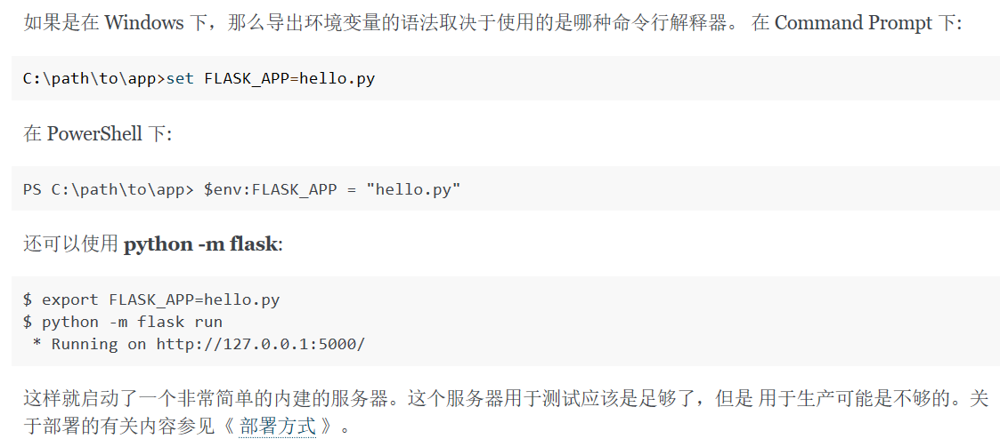

11.8 winsonhuang

# 网站工作原理总结

## HTTP层面

一个完整的访问步骤可以描述如下：

**步骤1**：浏览器首先向服务器**发送HTTP请求**，请求包括：

 方法：`GET`还是`POST`，`GET`仅请求资源，`POST`会附带用户数据；

 路径：`/full/url/path`；

域名：由Host头指定

 如果是POST，那么请求还包括一个Body，包含用户数据。

**步骤2**：服务器向浏览器**返回HTTP响应**，响应包括：

响应代码：`200`表示成功，`3xx`表示重定向，`4xx`表示客户端发送的请求有错误，`5xx`表示服务器端处理时发生了错误；

 响应类型：由`Content-Type`指定，例如：`Content-Type: text/html;charset=utf-8`表示响应类型是HTML文本，并且编码是`UTF-8`，`Content-Type: image/jpeg`表示响应类型是JPEG格式的图片；以及其他相关的Header；

通常服务器的HTTP响应会携带内容，也就是有一个Body，包含响应的内容，**网页的HTML源码就在Body中**。

**步骤3**：如果浏览器还需要继续向服务器请求其他资源，比如图片，就再次发出HTTP请求，重复步骤1、2。

当我们编写一个页面时，我们只需要在HTTP响应中把HTML发送出去，不需要考虑如何附带图片、视频等，浏览器如果需要请求图片和视频，它会发送另一个HTTP请求，因此，一个HTTP请求只处理一个资源。

#### HTTP格式：

可以看出，请求有两种，**post**有header和body，但是**get**只有header
响应response只有一种，并且一定有body，body的内容根据返回资源类型的不同而有格式上的差异。

## HTML

标记语言，由标签组成，表示一个网页的结构。可以用css控制样式

JavaScript是为了让HTML具有交互性而作为脚本语言添加的，JavaScript既可以内嵌到HTML中，也可以从外部链接到HTML中。

## WSGI

封装底层网络请求，根据我们编写符合标准的函数自动生成服务器，从而让我们专注于生成html页面

符合WSGI标准的HTTP处理函数接收两个参数：

- environ：一个包含所有HTTP请求信息的`dict`对象；
- start_response：一个发送HTTP响应的函数。

该函数可以从environ中解析出用户输入的url（以及其他信息），然后根据不同的url做不同的处理

## 框架

WSGI生成服务器的时候，只能利用一个HTTP处理函数，如果直接使用WSGI，则需要将所有的url以及对应的处理写在一个函数中，可维护性非常差。而框架的作用是提供修饰器以及视图函数机制，让我们可以将对不同url的处理放在不同的地方，逻辑上更加清晰。

## 模板

框架用于处理url的意思是根据不同的url生成不同的html页面，但是html语言嵌入到框架使用的语言中体验会非常差。况且不同的url对应的html页面可能只有一些微小的差异，整体结构是类似的。因此可以将**这些**整体结构抽取出来作为**许多**模板，然后根据url选取不同的模板并稍加修改就可以生成最后的页面。

待补充

